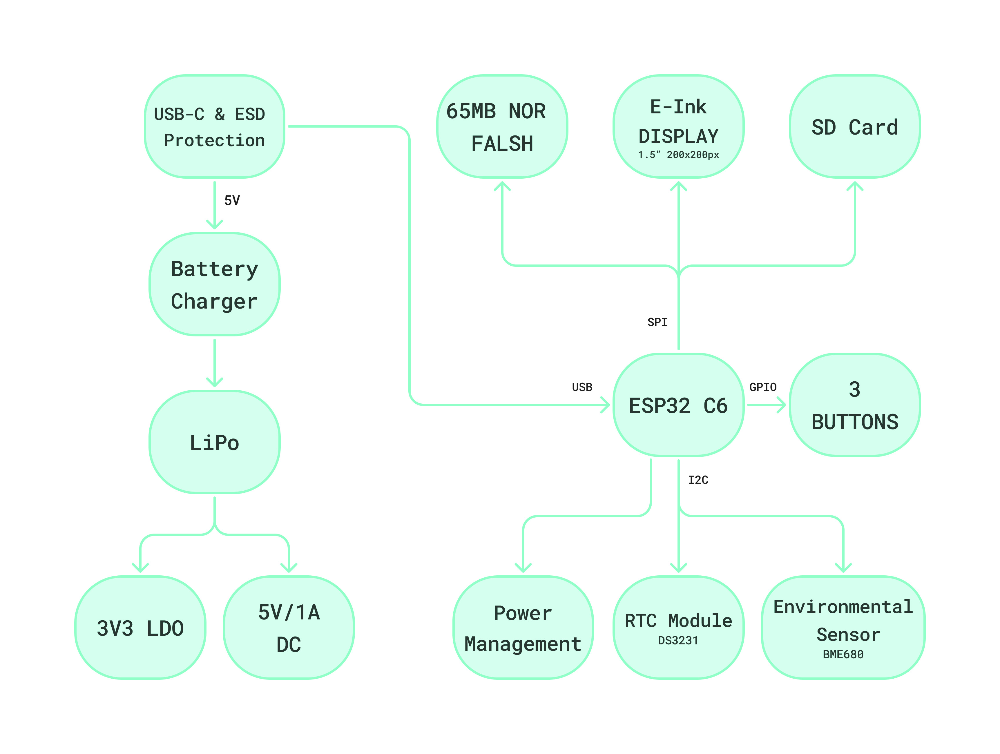

# OpenBook

## Introduction

OpenBook is an energy-efficient e-book reader designed with open-source principles, featuring Wi-Fi connectivity and environmental sensing capabilities. The device emphasizes a minimalist design, providing a distraction-free reading experience through a high-contrast e-paper display that mimics real paper, reducing eye strain during extended reading sessions.

## Block Diagram

## Hardware Description

### Microcontroller

The OpenBook is built around the **ESP32-C6-WROOM-1-N8** microcontroller:
- 32-bit RISC-V single-core processor running at up to 160MHz
- 320KB ROM, 512KB HP SRAM, 16KB LP SRAM
- Built-in Wi-Fi 6 and Bluetooth LE 5.0 connectivity
- Support for various interfaces: GPIO, SPI, UART, I2C, PWM
- Operating voltage: 3.3V

The ESP32-C6 offers excellent power efficiency with multiple power modes:
- Active mode: 160-260mA (when running at full capacity)
- Modem sleep: 3-20mA (Wi-Fi radio disabled)
- Light sleep: 0.8mA
- Deep sleep: 10μA (core powered down, wake sources active)
- Hibernation: 2.5μA (minimal functions active)

### Display Interface

The OpenBook connects to a 7.5" E-Paper Display through an FPC connector. The display communicates via SPI:
- EPD_CS connected to ESP32-C6 GPIO10
- EPD_DC connected to ESP32-C6 GPIO5
- EPD_RST connected to ESP32-C6 GPIO23
- EPD_BUSY connected to ESP32-C6 GPIO3
- MOSI, SCK shared with SD card interface

The e-paper display was chosen for its paper-like appearance, ultra-low power consumption (only requires power during page refreshes), and excellent readability in direct sunlight.

### Storage Solutions

The OpenBook features dual storage solutions:

1. **MicroSD Card Interface** (primary storage for e-books):
   - Connected via SPI protocol
   - Card Detect/DAT3 connected to ESP32-C6 GPIO4
   - CMD connected to ESP32-C6 GPIO7 (MOSI for SPI)
   - DAT0 connected to ESP32-C6 GPIO2 (MISO for SPI)
   - CLK connected to ESP32-C6 GPIO6 (SCK for SPI)
   
2. **64MB NOR Flash Memory** (firmware and system storage):
   - Connected via SPI protocol
   - CS connected to ESP32-C6 GPIO11
   - Shares MOSI, MISO, and SCK with the SD card interface
   - Provides reliable non-volatile storage for the operating system and application code

### Real-Time Clock (RTC)

A DS3231SN RTC module maintains accurate timekeeping even when the device is powered off:
- Communicates via I2C protocol
- SCL connected to ESP32-C6 GPIO22
- SDA connected to ESP32-C6 GPIO21
- Reset pin connected to ESP32-C6 GPIO18
- 32KHz output connected to ESP32-C6 GPIO1
- SQW/INT connected to ESP32-C6 GPIO0
- Features a backup battery input for continuous timekeeping
- Temperature-compensated crystal oscillator for high accuracy (+/-2ppm)

### Environmental Sensing

The BME688 environmental sensor provides comprehensive monitoring:
- Digital low-power gas, pressure, temperature, and humidity sensor
- Communicates via I2C (shared bus with RTC)
- SCK connected to ESP32-C6 GPIO22 (SCL for I2C)
- SDI connected to ESP32-C6 GPIO21 (SDA for I2C)
- Control pins connected to ESP32-C6 GPIO19
- Power consumption: 3.7μA at 1Hz sampling rate; 0.15μA in sleep mode
- Temperature range: -40 to +85°C
- Humidity measurement range: 0-100% RH
- Pressure range: 300-1100 hPa

### Power Management

The OpenBook is designed for extended battery life:

1. **USB-C Connector**:
   - Industry-standard charging and data interface
   - Connected to ESP32-C6 via USB lines (GPIO12/GPIO13)
   - ESD protection provided by USBLC6-2SC6Y
   
2. **Li-Po Battery Charging Controller (MCP73831)**:
   - Handles battery charging from USB with programmable charge current
   - Input voltage: 3.75V to 6V
   - Battery output protection circuitry

3. **LDO Voltage Regulator (XC6220A331MR-G)**:
   - Provides stable 3.3V from battery voltage
   - Low quiescent current: 1μA
   - High efficiency operation

4. **Battery Fuel Gauge (MAX17048G+T10)**:
   - Monitors battery charge level using ModelGauge algorithm
   - Communicates via I2C (shared bus with RTC and BME688)
   - SCL connected to ESP32-C6 GPIO22
   - SDA connected to ESP32-C6 GPIO21
   - Power consumption: 23μA active, 3μA hibernate
   - Provides accurate remaining capacity estimation

### User Input

Three physical buttons provide intuitive navigation:
1. **Reset Button**: Connected to ESP32-C6 Enable pin
2. **Boot Button**: Connected to ESP32-C6 GPIO9
3. **Navigation Button**: Connected to ESP32-C6 GPIO15

Each button includes debouncing circuitry to ensure reliable operation.

### Expansion Capability

A Qwiic connector provides expandability:
- Compatible with Stemma QT sensors and modules
- Connects to the I2C bus
- Allows for easy addition of future sensors without soldering

## Pin Allocation of ESP32-C6

| Pin Number | GPIO | Function              | Component                             | Reason for Selection                                    |
|------------|------|------------------------|---------------------------------------|--------------------------------------------------------|
| 3          | EN   | Reset                  | Reset Button                          | Hardware-defined enable pin                             |
| 8          | GPIO0 | SQW/INT               | RTC DS3231SN Interrupt                | Allows RTC-based wakeup from sleep                      |
| 9          | GPIO1 | 32KHz input           | RTC DS3231SN 32KHz output             | Provides precise timing reference                       |
| 27         | GPIO2 | MISO                  | SD Card, E-Paper, NOR Flash           | Hardware SPI MISO line                                  |
| 28         | GPIO3 | EPD_BUSY              | E-Paper Display busy signal           | Status monitoring for display                           |
| 30         | GPIO4 | SD_CS                 | SD Card chip select                   | SPI device selection                                    |
| 31         | GPIO5 | EPD_DC                | E-Paper Display data/command          | Display controller communication                         |
| 32         | GPIO6 | SCK                   | SD Card, E-Paper, NOR Flash           | Hardware SPI clock                                      |
| 33         | GPIO7 | MOSI                  | SD Card, E-Paper, NOR Flash           | Hardware SPI MOSI line                                  |
| 13         | GPIO9 | Boot                  | Boot Button                           | Boot mode selection                                     |
| 14         | GPIO10 | EPD_CS               | E-Paper Display chip select           | SPI device selection                                    |
| 15         | GPIO11 | FLASH_CS             | NOR Flash chip select                 | SPI device selection                                    |
| 16         | GPIO12 | USB_D-               | USB Data negative                     | USB communication                                       |
| 17         | GPIO13 | USB_D+               | USB Data positive                     | USB communication                                       |
| 23         | GPIO15 | Navigation           | Navigation Button                     | User input                                              |
| 16         | GPIO18 | RTC_RST              | RTC reset                             | Reset control for RTC                                   |
| 17         | GPIO19 | I2C_PW               | BME688 power control                  | Power management for sensor                             |
| 19         | GPIO21 | SDA                  | I2C data (RTC, BME688, Battery Gauge) | Hardware I2C data line                                  |
| 20         | GPIO22 | SCL                  | I2C clock (RTC, BME688, Battery Gauge)| Hardware I2C clock line                                 |
| 21         | GPIO23 | EPD_RST              | E-Paper Display reset                 | Display initialization control                          |

## Bill of Materials (BOM)

| Component                     | Description                                   | Price (EUR) | Provider                                                                                                   | Datasheet                                                                                                    |
|-------------------------------|-----------------------------------------------|-------------|------------------------------------------------------------------------------------------------------------|------------------------------------------------------------------------------------------------------------|
| ESP32-C6-WROOM-1-N8          | Main Microcontroller                          | 2.99        | [Mouser](https://eu.mouser.com/ProductDetail/Espressif-Systems/ESP32-C6-WROOM-1U-N8?qs=1Kr7Jg1SGW%2FzPU4G%252ByMwkA%3D%3D) | [Datasheet](https://eu.mouser.com/datasheet/2/891/Espressif_Systems_7_11_2023_esp32_c6_wroom_1_wroom-3236277.pdf) |
| USB4110-GF-A                  | USB-C Connector                               | 0.39        | [Mouser](https://eu.mouser.com/ProductDetail/Same-Sky/UJC-H-G-SMT-2-P6-TR?qs=IKkN%2F947nfApFV8T6rOqww%3D%3D) | [Datasheet](https://eu.mouser.com/datasheet/2/1628/ujc_h_g_smt_2_p6_tr-3511211.pdf)                          |
| USBLC6-2SC6Y                  | USB ESD Protection                            | 0.44        | [Mouser](https://eu.mouser.com/ProductDetail/STMicroelectronics/USBLC6-2SC6Y?qs=gNDSiZmRJS%2FOgDexvXkdow%3D%3D) | [Datasheet](https://eu.mouser.com/datasheet/2/389/usblc6_2sc6y-1852505.pdf)                                   |
| DMG2305UX-7                   | P-Channel MOSFET                              | 0.19 × 2    | [Mouser](https://eu.mouser.com/ProductDetail/Diodes-Incorporated/DMG2305UX-7?qs=L1DZKBg7t5F%2FNBHrjfxC%252Bg%3D%3D) | [Datasheet](https://www.diodes.com/assets/Datasheets/DMG2305UX.pdf)                                           |
| SD0805S020S1R0                | Schottky Diode                                | 0.30 × 2    | [Mouser](https://eu.mouser.com/ProductDetail/KYOCERA-AVX/SD0805S020S1R0?qs=jCA%252BPfw4LHbpkAoSnwrdjw%3D%3D) | [Datasheet](https://eu.mouser.com/datasheet/2/40/schottky-3165252.pdf)                                       |
| XC6220A331MR-G                | LDO Voltage Regulator                         | 1.46        | [Mouser](https://eu.mouser.com/ProductDetail/Torex-Semiconductor/XC6220A331MR-G?qs=AsjdqWjXhJ8ZSWznL1J0gg%3D%3D) | [Datasheet](https://eu.mouser.com/datasheet/2/760/xc6220-3371556.pdf)                                         |
| 293D107X9010D2TE3             | Tantalum Capacitor                            | 0.68        | [Mouser](https://eu.mouser.com/ProductDetail/Vishay-Sprague/293D107X9010D2TE3?qs=8dfOI6wKXonVqFgS8%252BQ%2FMA%3D%3D) | [Datasheet](https://www.vishay.com/docs/40002/293d.pdf)                                                       |
| 112A-TAAR-R03                 | MicroSD Card Socket                           | 1.10        | [Comet](https://store.comet.srl.ro/Catalogue/Product/43497/)                                               | [Datasheet](https://store.comet.bg/download-file.php?id=27596)                                                |
| IFDC5050JZER680M              | 68µH Power Inductor                           | 0.90        | [Mouser](https://eu.mouser.com/ProductDetail/Vishay-Dale/IFDC5050JZER680M?qs=iLKYxzqNS745SePZd8tBoA%3D%3D) | [Datasheet](https://www.vishay.com/docs/34635/ifdc5050jz.pdf)                                                |
| MBR0530-TP                    | Schottky Diode                                | 0.14 × 3    | [Mouser](https://eu.mouser.com/ProductDetail/Micro-Commercial-Components-MCC/MBR0530-TP?qs=KFo7JewZbUECRHkxGanrdg%3D%3D) | [Datasheet](https://eu.mouser.com/datasheet/2/258/MBR0520_MBR0580_SOD123_-2492194.pdf)                      |
| SI1308EDL-T1-GE3              | N-Channel MOSFET                              | 0.42 × 2    | [Mouser](https://eu.mouser.com/ProductDetail/Vishay-Semiconductors/SI1308EDL-T1-GE3?qs=bX1%252BNvsK%2FBramh9tgpOaEw%3D%3D) | [Datasheet](https://www.vishay.com/docs/63399/si1308edl.pdf)                                                |
| KGF21BR71H104KT               | 0.1µF Capacitor                               | 0.30        | [Mouser](https://eu.mouser.com/ProductDetail/KYOCERA-AVX/KGF21BR71H104KT?qs=Jm2GQyTW%2FbjYyKCvVWAEOw%3D%3D) | [Datasheet](https://eu.mouser.com/datasheet/2/40/KGF-3223650.pdf)                                            |
| MAASL105CC7105MFCA01          | 1µF Capacitor                                 | 0.13 × 10   | [Mouser](https://eu.mouser.com/ProductDetail/TAIYO-YUDEN/MAASL105CC7105MFCA01?qs=HFfMDpzxxd1Fn%2FInbJA7vw%3D%3D) | [Datasheet](https://eu.mouser.com/datasheet/2/396/TAIYO_YUDEN_04_27_2024_c_mlcc_A_e1-3451516.pdf)           |
| CM05X5R475M16AH               | 4.7µF Capacitor                               | 0.23 × 5    | [Mouser](https://eu.mouser.com/ProductDetail/KYOCERA-AVX/CM05X5R475M16AH?qs=doiCPypUmgFT1xquZKhWtQ%3D%3D) | [Datasheet](https://eu.mouser.com/datasheet/2/40/Kyocera_AVX_Components_CM025_CM05_CM105_CM21_E217K-2932876.pdf) |
| CGA3EDX7T1A106M080AU          | 10µF Capacitor                                | 0.47        | [Mouser](https://eu.mouser.com/ProductDetail/TDK/CGA3EDX7T1A106M080AU?qs=ZcfC38r4PovL%2FBNBUzzBFw%3D%3D) | [Datasheet](https://product.tdk.com/system/files/dam/doc/product/capacitor/ceramic/mlcc/catalog/mlcc_automotive_general_en.pdf) |
| KAM21BR71H104JT               | 100nF Capacitor                               | 0.30 × 8    | [Mouser](https://eu.mouser.com/ProductDetail/KYOCERA-AVX/KAM21BR71H104JT?qs=Jm2GQyTW%2Fbic6Zk4McEt6w%3D%3D) | [Datasheet](https://eu.mouser.com/datasheet/2/40/AutoMLCCKAM-3216307.pdf)                                    |
| RNCL1210FT50L0                | 0.47Ω Resistor                                | 0.30        | [Mouser](https://eu.mouser.com/ProductDetail/SEI-Stackpole/RNCL1210FT50L0?qs=17ckDYBRdelVLOJ%252BDFjlUw%3D%3D) | [Datasheet](https://eu.mouser.com/datasheet/2/385/sei_rncl-3223524.pdf)                                      |
| RT1206FRE072R2L               | 2.2Ω Resistor                                 | 0.13        | [Mouser](https://eu.mouser.com/ProductDetail/YAGEO/RT1206FRE072R2L?qs=XhSZopxZ3H6S0nYZD83pAA%3D%3D) | [Datasheet](https://eu.mouser.com/datasheet/2/447/PYu_RT_1_to_0_01_RoHS_L_15-3461507.pdf)                    |
| ERA-6AHD150V                  | 15Ω Resistor                                  | 0.25        | [Mouser](https://eu.mouser.com/ProductDetail/Panasonic/ERA-6AHD150V?qs=MNPzkKEzRtQip8ZeekU%252BRw%3D%3D) | [Datasheet](https://industrial.panasonic.com/cdbs/www-data/pdf/RDM0000/AOA0000C307.pdf)                     |
| RP73C2B200RFTDF               | 200Ω Resistor                                 | 0.33        | [Mouser](https://eu.mouser.com/ProductDetail/TE-Connectivity-Holsworthy/RP73C2B200RFTDF?qs=n4i9pByFsMR0dWGpf721CA%3D%3D) | [Datasheet](https://eu.mouser.com/datasheet/2/418/10/ENG_DS_1773272_M1-1588495.pdf)                          |
| ERA-3AED202V                  | 2kΩ Resistor                                  | 0.16        | [Mouser](https://eu.mouser.com/ProductDetail/Panasonic/ERA-3AED202V?qs=yocZuyCaXdM2cBmjcGkIyA%3D%3D) | [Datasheet](https://industrial.panasonic.com/cdbs/www-data/pdf/RDM0000/AOA0000C307.pdf)                     |
| MCS04020C5101FE000            | 5.1kΩ Resistor                                | 0.15 × 2    | [Mouser](https://eu.mouser.com/ProductDetail/Vishay-Beyschlag/MCS04020C5101FE000?qs=wTZ%2FFzl837YsKPLPRIXUbg%3D%3D) | [Datasheet](https://www.vishay.com/docs/28705/mcx0x0xpro.pdf)                                               |
| RNWA0612BTE10K0               | 10kΩ Resistor                                 | 0.32 × 16   | [Mouser](https://eu.mouser.com/ProductDetail/SEI-Stackpole/RNWA0612BTE10K0?qs=IKkN%2F947nfD62pDKWE9ZTQ%3D%3D) | [Datasheet](https://eu.mouser.com/datasheet/2/385/SEI_RNWA-3473840.pdf)                                      |
| ERA-3AED104V                  | 100kΩ Resistor                                | 0.10        | [Mouser](https://eu.mouser.com/ProductDetail/Panasonic/ERA-3AED104V?qs=MNPzkKEzRtQIWcmUWL4kjg%3D%3D) | [Datasheet](https://industrial.panasonic.com/cdbs/www-data/pdf/RDM0000/AOA0000C307.pdf)                     |
| MCP73831-2ACI-MC              | Li-Po Battery Charging Controller             | 0.75        | [Mouser](https://eu.mouser.com/ProductDetail/Microchip-Technology/MCP73831-2ACI-MC?qs=hH%252BOa0VZEiBneYTVdpuVdg%3D%3D) | [Datasheet](https://eu.mouser.com/datasheet/2/268/MCP73831_Family_Data_Sheet_DS20001984H-3441711.pdf)       |
| FH34SRJ-24S-0.5SH(99)         | FPC Connector for E-Paper                     | 2.60        | [Mouser](https://eu.mouser.com/ProductDetail/Hirose-Connector/FH34SRJ-24S-0.5SH99?qs=vcbW%252B4%252BSTIpKBl5ap9J8Fw%3D%3D) | [Datasheet](https://eu.mouser.com/datasheet/2/185/FH34SRJ_24S_0_5SH_99__CL0580_1255_6_99_2DDrawing_0-1615044.pdf) |
| BME688                        | Environmental Sensor                          | 9.86        | [Mouser](https://eu.mouser.com/ProductDetail/Bosch-Sensortec/BME688?qs=IS%252B4QmGtzzqQoVDscqwx3A%3D%3D) | [Datasheet](https://eu.mouser.com/datasheet/2/783/bst_bme688_fl000-2307034.pdf)                              |
| BD5229G-TR                    | Voltage Detector                              | 0.75        | [Mouser](https://eu.mouser.com/ProductDetail/ROHM-Semiconductor/BD5229G-TR?qs=4kLU8WoGk0vvnhrrYwdszw%3D%3D) | [Datasheet](https://fscdn.rohm.com/en/products/databook/datasheet/ic/power/voltage_detector/bd52xxg-e.pdf)  |
| MAX17048G+T10                 | Battery Fuel Gauge                            | 4.28        | [Mouser](https://eu.mouser.com/ProductDetail/Analog-Devices-Maxim-Integrated/MAX17048G%2bT10?qs=D7PJwyCwLAoGnnn8jEPRBQ%3D%3D) | [Datasheet](https://eu.mouser.com/datasheet/2/609/MAX17048_MAX17049-3469099.pdf)                             |
| DS3231SN#                     | RTC Module                                    | 14.91       | [Mouser](https://eu.mouser.com/ProductDetail/Analog-Devices-Maxim-Integrated/DS3231SN?qs=1eQvB6Dk1vhUlr8%2FOrV0Fw%3D%3D) | [Datasheet](https://eu.mouser.com/datasheet/2/609/DS3231-3421123.pdf)                                        |
| CPH3225A                      | RTC Backup Battery                            | 2.33        | [Mouser](https://eu.mouser.com/ProductDetail/Seiko-Semiconductors/CPH3225A?qs=3etwrb1wR%252BhUOph6lAO7eg%3D%3D) | [Datasheet](https://eu.mouser.com/datasheet/2/360/Seiko_Instruments_MicroBattery_E_20230330_2024Jan_-3561061.pdf) |
| PRT-14417                     | Qwiic Connector                               | 3.75        | [Mouser](https://eu.mouser.com/ProductDetail/Adafruit/4208?qs=PzGy0jfpSMtbScLbr0L5dw%3D%3D) | [Datasheet](https://learn.adafruit.com/introducing-adafruit-stemma-qt/technical-specs)                      |
| PGB1010603MR                  | ESD Protection                                | 0.40 × 6    | [Mouser](https://eu.mouser.com/ProductDetail/Littelfuse/PGB1010603MR?qs=gu7KAQ731URLg4GSnNNN7Q%3D%3D) | [Datasheet](https://www.littelfuse.com/assetdocs/pulseguard-esd-suppressors-pgb1-datasheet?assetguid=8a337998-d54d-466b-be4e-dc5bcd1f9321) |
| W25Q512JVEIQ                  | 64MB NOR Flash Memory                         | 5.84        | [Mouser](https://eu.mouser.com/ProductDetail/Winbond/W25Q512JVEIQ?qs=l7cgNqFNU1jw6svr3at6tA%3D%3D) | [Datasheet](https://eu.mouser.com/datasheet/2/949/Winbond_W25Q512JV_Datasheet-3240039.pdf)                   |
| LP584174                      | 2500mAh Li-Po Battery                         | 6.40        | [TME](https://www.tme.eu/en/details/accu-lp584174_cl/rechargeable-batteries/cellevia-batteries/l584174/) | [Datasheet](https://www.tme.eu/Document/e0683d8c34e6d878124489f71bffb6ee/cel0014.pdf)                        |
| MT-DEPG0750BNU590F1           | 7.5" E-Paper Display                          | 48.00       | [Mouser](https://eu.mouser.com/ProductDetail/Microtips-Technology/MT-DEPG0750BNU590F1?qs=DPoM0jnrROVRMMTX0WzK%252Bw%3D%3D) | [Datasheet](https://eu.mouser.com/datasheet/2/271/MT_DEPG0750BNU590F1_V2_7-1894282.pdf)                     |

## Power Consumption Analysis

The OpenBook is designed for maximum battery efficiency:

1. **Peak Power Mode** (Wi-Fi active, display refreshing):
   - ESP32-C6: 160-260mA
   - E-Paper (during refresh): 20-50mA
   - SD Card (active): 30-100mA
   - Other components: ~20-30mA
   - **Total peak consumption**: ~230-440mA

2. **Active Reading Mode** (Wi-Fi disabled, display static):
   - ESP32-C6 (Modem sleep): 3-20mA
   - E-Paper (static): ~0mA
   - SD Card (periodic access): ~5mA average
   - Other components: ~5-10mA
   - **Total active consumption**: ~13-35mA

3. **Standby Mode** (waiting for input):
   - ESP32-C6 (Light sleep): 0.8mA
   - All peripherals in low-power: ~1mA
   - **Total standby consumption**: ~1.8mA

4. **Deep Sleep Mode** (longer periods of inactivity):
   - ESP32-C6 (Deep sleep): 10μA
   - RTC active: 0.2μA
   - Battery monitoring (periodic): ~0.5μA average
   - **Total deep sleep consumption**: ~11μA

With a 2500mAh battery, theoretical runtime estimates:
- Continuous active reading: ~71-192 hours (3-8 days)
- Standby mode: ~1388 hours (~58 days)
- Deep sleep mode: ~227,272 hours (~9,469 days or ~26 years)

In practical usage with mixed operation modes and periodic Wi-Fi synchronization, users can expect 2-4 weeks of regular

Note: props to the Gemini within Google Drawings for helping me with the drawing:)
